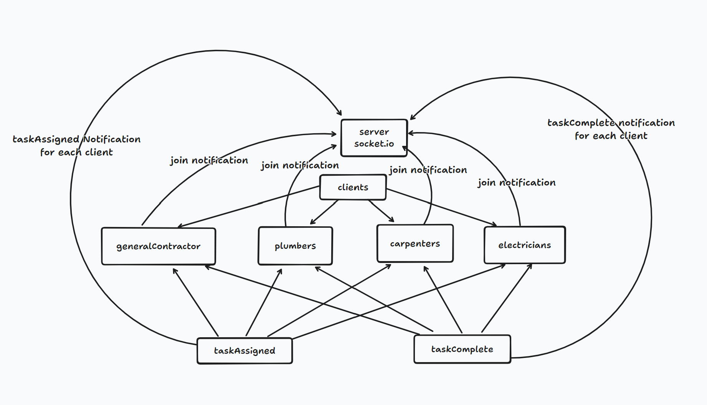

# Collab #

## Project description: ##
** Purpose:** A collaborative task management system for a construction team, allowing real-time task assignment, tracking, and completion across different roles.
**Key Roles:** General Contractor, Carpenters, Plumbers, Electricians.
Communication Protocol: Socket.IO for real-time communication and event-driven architecture.

## Getting Started ##
Requirements
For development, you will only need Node installed in your environment. Please use the appropriate Editorconfig plugin for your Editor (not mandatory).

**Whiteboard:**

**Install**
git clone https://github.com/ORG/PROJECT.git
cd PROJECT
**npm install**
"dependencies":
    "chance": "^1.1.11",
    "jest": "^29.7.0",
    "nodemon": "^3.1.0",
    "socket.io": "^4.7.5",
    "socket.io-client": "^4.7.5"
Configure app
Any environment configuration steps.

**Start & watch**
npm run dev:server
node (client index.js) example: /clients/GeneralContractor/index.js

**Architecture**
**Server:** 
Hosts the Socket.IO server and manages communication with connected clients.
Namespace: /tasks - All task-related events and communication happen within this namespace.
**Task Queues:**
generalContractorQueue - FIFO queue for the general contractor.
carpentersQueue, plumbersQueue, electriciansQueue - Standard queues for carpenters, plumbers, and electricians.
**Event Handlers:**
assignTask: Adds a task to the appropriate queue based on the role.
completeTask: Marks a task as completed and removes it from the appropriate queue.
**Emit Events:**
taskAssigned: Notifies clients when a task is assigned.
taskCompleted: Notifies clients when a task is completed.
Clients: Represent different roles in the construction team, connecting to the server and interacting with tasks.
**General Contractor:**
Connects to /tasks namespace.
Emits assignTask and completeTask events.
Listens for taskAssigned and taskCompleted events.
Carpenters, Plumbers, Electricians: Each with similar interactions as the General Contractor.
Emit and listen to task-related events to stay updated on task assignments and completions.

Languages & tools
nodeJS
socket.io
socket.io-client
